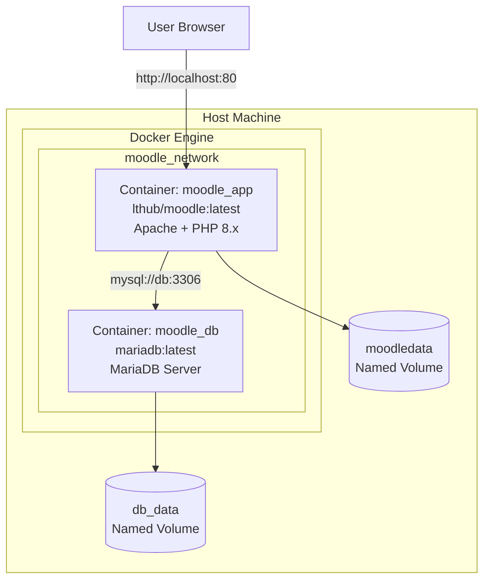

# สรุปโปรเจ็ค Moodle Administration LAB 2025

## ภาพรวมโปรเจ็ค

นี่คือ **ใบงานการทดลอง** สำหรับนักศึกษาที่ต้องเรียนรู้การติดตั้งและจัดการ Moodle LMS ด้วย Docker Compose

---

## ไฟล์ในโปรเจ็ค

| ไฟล์ | วัตถุประสงค์ |
|------|-------------|
| [Moodle_Docker_Lab_Complete.md](Moodle_Docker_Lab_Complete.md) | ใบงานหลัก - ทฤษฎี, ขั้นตอน, คำถาม |
| [docker-compose.yml](docker-compose.yml) | ไฟล์ Docker Compose พร้อมใช้ |
| [README.md](README.md) | คู่มือแบบย่อ |
| `images/` | รูปภาพ 6 รูปสำหรับประกอบใบงาน |

---

## วัตถุประสงค์การเรียนรู้ (4 ข้อ)

1. อธิบายหลักการทำงานของ Docker Container, Volume และ Network
2. อธิบายสถาปัตยกรรม Moodle LMS แบบ Multi-container
3. ติดตั้ง Moodle LMS โดยใช้ Docker Compose
4. ตั้งค่าและจัดการระบบ LMS ในฐานะผู้ดูแลระบบ

---

## สถาปัตยกรรมระบบ



**ส่วนประกอบหลัก:**

- **Container 1: moodle_app** - Moodle Application (Apache + PHP + Moodle Core)
- **Container 2: moodle_db** - MariaDB Database Server
- **Volume: moodledata** - เก็บไฟล์ผู้ใช้, Cache, Session
- **Volume: db_data** - เก็บข้อมูล Database
- **Network: moodle_network** - Bridge Network สำหรับการสื่อสารระหว่าง Container

---

## Checklist สิ่งที่ต้องทำและบันทึกผลการทดลอง

### ขั้นตอนที่ 1-2: ติดตั้ง Docker และรัน Containers

| สถานะ | บันทึก | รายละเอียด | คำสั่ง/ขั้นตอน |
|:-----:|--------|-----------|----------------|
| ☐ | **บันทึก 1** | รูปผลการโหลด Docker Images | `docker pull lthub/moodle:education-4.5.8` และ `docker pull mariadb:latest` |
| ☐ | **บันทึก 2** | รูปผลการรัน docker-compose | `docker-compose up -d` |
| ☐ | **บันทึก 3** | รูปผลการตรวจสอบสถานะ | `docker-compose ps` |
| ☐ | **บันทึก 4** | รูปผล Logs | `docker-compose logs -f moodle` |
| ☐ | **บันทึก 5** | รูปผลการตรวจสอบ Volume | `docker volume ls` และ `docker volume inspect` |

### ขั้นตอนที่ 3: ติดตั้ง Moodle ผ่าน Web Interface

| สถานะ | บันทึก | รายละเอียด | ขั้นตอน |
|:-----:|--------|-----------|---------|
| ☐ | **บันทึก 6** | รูป Dashboard หลังติดตั้งเสร็จ | เข้า http://localhost กรอกข้อมูล Admin และ Site |

**ข้อมูลที่ต้องกรอก:**

| Field | Value | หมายเหตุ |
|-------|-------|----------|
| Username | `admin` | ไม่สามารถเปลี่ยนได้ |
| Password | `Admin@2025!` | ต้องมีตัวพิมพ์ใหญ่, ตัวเลข, อักขระพิเศษ |
| First name | ชื่อนักศึกษา | กรอกชื่อจริง |
| Surname | นามสกุลนักศึกษา | กรอกนามสกุล |
| Email | อีเมล์นักศึกษา | ใช้อีเมล์จริง |
| Site name | `ชื่อ-นามสกุล นักศึกษา-Moodle LMS` | ตั้งชื่อเว็บไซต์ |

### ขั้นตอนที่ 4: การตั้งค่าระบบ (Site Administration)

| สถานะ | บันทึก | รายละเอียด | เมนู |
|:-----:|--------|-----------|------|
| ☐ | **บันทึก 6-1** | รูปผลการปรับแต่ง Theme | Site admin > Appearance > Themes > Boost |

**การตั้งค่าที่ต้องทำ:**

- [ ] Location: Default timezone = Asia/Bangkok, Country = Thailand
- [ ] Language: ติดตั้งภาษาไทย (ถ้าต้องการ)
- [ ] Security: Password policy (8 ตัว, ตัวพิมพ์ใหญ่/เล็ก, ตัวเลข, อักขระพิเศษ)
- [ ] Theme: ปรับแต่ง Boost theme, อัพโหลด Logo

### ขั้นตอนที่ 5: จัดการ Course และ Users

| สถานะ | บันทึก | รายละเอียด | ขั้นตอน |
|:-----:|--------|-----------|---------|
| ☐ | **บันทึก 7** | รูป Course Categories ตามกลุ่มสาระ สพฐ. | สร้าง Categories ตาม 8 กลุ่มสาระการเรียนรู้ |
| ☐ | **บันทึก 8** | รูปผลการสร้างรายวิชา | สร้าง Course ใน Category ที่เลือก |
| ☐ | **บันทึก 9** | รูปผลการสร้าง User ใหม่ | Site admin > Users > Add a new user |
| ☐ | **บันทึก 10** | รูปผลการ Upload Users (CSV) | อัพโหลด CSV มีนักเรียน 3 คน + ครู 3 คน |
| ☐ | **บันทึก 11** | รูปผลการ Upload Users + Cohort | อัพโหลด CSV เพิ่ม 5 คน พร้อมคอลัมน์ cohort |

**กลุ่มสาระการเรียนรู้ สพฐ. (สำหรับสร้าง Category):**

| ลำดับ | กลุ่มสาระการเรียนรู้ |
|:-----:|---------------------|
| 1 | ภาษาไทย |
| 2 | คณิตศาสตร์ |
| 3 | วิทยาศาสตร์และเทคโนโลยี |
| 4 | สังคมศึกษา ศาสนา และวัฒนธรรม |
| 5 | สุขศึกษาและพลศึกษา |
| 6 | ศิลปะ |
| 7 | การงานอาชีพ |
| 8 | ภาษาต่างประเทศ |

---

## คำถามท้ายใบงาน (11 ข้อ) พร้อมแนวคำตอบ

### ข้อ 1: อธิบายความแตกต่างระหว่าง Docker Image และ Docker Container

**แนวคำตอบ:**
- **Docker Image** = Template อ่านอย่างเดียว เปรียบเสมือน Class ในการเขียนโปรแกรม เป็นต้นแบบที่ใช้สร้าง Container
- **Docker Container** = Instance ที่รันจาก Image เปรียบเสมือน Object ที่สร้างจาก Class สามารถอ่าน-เขียนข้อมูลได้

**ตัวอย่าง:** 
- Image `lthub/moodle:latest` เป็นต้นแบบ
- Container `moodle_app` คือ Instance ที่รันจาก Image นั้น

---

### ข้อ 2: จากสถาปัตยกรรมในการทดลอง มี Container กี่ตัว? แต่ละตัวมีหน้าที่อะไร?

**แนวคำตอบ:**
มี **2 Container**:

| Container | Image | หน้าที่ |
|-----------|-------|--------|
| `moodle_app` | lthub/moodle:latest | รัน Moodle Application (Apache Web Server + PHP 8.x + Moodle Core) |
| `moodle_db` | mariadb:latest | รัน MariaDB Database Server เก็บข้อมูลผู้ใช้ รายวิชา และข้อมูลทั้งหมด |

---

### ข้อ 3: จากการทดลองมีการจัดการ Volume แบบใด มีข้อดีข้อเสียอย่างไร?

**แนวคำตอบ:**
ใช้ **Named Volume** (Volume ที่มีชื่อกำหนด)

| ข้อดี | ข้อเสีย |
|------|--------|
| ข้อมูลไม่หายแม้ลบ Container | ต้องจัดการ Volume เอง |
| Backup และ Restore ง่าย | ใช้พื้นที่จัดเก็บมากขึ้น |
| Share ข้อมูลระหว่าง Container ได้ | ต้องระวังเรื่อง Permission |
| แยก Lifecycle ของข้อมูลจาก Container | - |

---

### ข้อ 4: Network ใน Docker Compose ทำหน้าที่อะไร? Container สื่อสารกันอย่างไร?

**แนวคำตอบ:**
- **Bridge Network** (`moodle_network`) ทำหน้าที่เป็น Virtual Network ภายในเครื่อง Host
- Container สื่อสารกันผ่าน **Container name/hostname**
- ตัวอย่าง: `moodle_app` ใช้ hostname `db` เชื่อมต่อไปยัง `moodle_db` ผ่าน port 3306

```
moodle_app --[Bridge Network]--> moodle_db (hostname: db, port: 3306)
```

---

### ข้อ 5: `depends_on` ในไฟล์ docker-compose.yml มีความสำคัญอย่างไร?

**แนวคำตอบ:**
- กำหนด **ลำดับการเริ่มต้น** Container
- ในไฟล์นี้ `moodle` มี `depends_on: db` หมายความว่า:
  - Container `db` (MariaDB) ต้องเริ่มทำงานก่อน
  - จากนั้น Container `moodle` จึงจะเริ่มทำงาน
- ป้องกันปัญหา Database connection error เมื่อ Moodle เริ่มทำงานก่อน Database

---

### ข้อ 6: ถ้าต้องการเปลี่ยน Port ของ Moodle เป็น 9000 ต้องแก้ไขส่วนใดของไฟล์?

**แนวคำตอบ:**
แก้ไขส่วน `ports` ของ service `moodle` ในไฟล์ `docker-compose.yml`:

```yaml
moodle:
  ...
  ports:
    - "9000:80"  # เปลี่ยนจาก "8080:80" เป็น "9000:80"
```

จากนั้นเข้าใช้งานผ่าน `http://localhost:9000`

---

### ข้อ 7: Environment Variables `MOODLE_DB_HOST=db` หมายความว่าอย่างไร? ทำไมไม่ใช้ `localhost`?

**แนวคำตอบ:**
- `MOODLE_DB_HOST=db` หมายถึงให้ Moodle เชื่อมต่อไปยัง Container ที่มี hostname ว่า `db`
- **ไม่ใช้ localhost** เพราะ:
  - แต่ละ Container มี Network namespace แยกกัน
  - `localhost` ใน Container `moodle_app` หมายถึงตัว Container นั้นเอง ไม่ใช่ Container `moodle_db`
  - Docker DNS จะ resolve hostname `db` ไปยัง IP ของ Container `moodle_db` โดยอัตโนมัติ

---

### ข้อ 8: เปรียบเทียบข้อดีและข้อเสียของการติดตั้ง Moodle ด้วย Docker เทียบกับการติดตั้งแบบปกติ

**แนวคำตอบ:**

| หัวข้อ | Docker | การติดตั้งแบบปกติ |
|-------|--------|------------------|
| **ความง่าย** | ง่ายมาก (คำสั่งเดียว) | ซับซ้อน (ติดตั้งหลายส่วน) |
| **Portability** | ย้ายไปเครื่องอื่นง่าย | ต้องติดตั้งใหม่ทั้งหมด |
| **Isolation** | แยกจากระบบหลัก | ติดตั้งบนระบบโดยตรง |
| **ทำซ้ำได้** | ใช้ docker-compose.yml | ต้องจด/บันทึกขั้นตอน |
| **Performance** | เสีย overhead เล็กน้อย | ดีกว่าเล็กน้อย |
| **ความยืดหยุ่น** | จำกัดตาม Image | ปรับแต่งได้มากกว่า |

---

### ข้อ 9: ถ้าต้องการเพิ่ม Container Redis สำหรับ Caching จะต้องแก้ไข docker-compose.yml อย่างไร?

**แนวคำตอบ:**

```yaml
services:
  db:
    # ... (เหมือนเดิม)

  moodle:
    # ... (เหมือนเดิม)
    depends_on:
      - db
      - redis  # เพิ่ม dependency

  redis:
    image: redis:latest
    container_name: moodle_redis
    networks:
      - moodle_network
    volumes:
      - redis_data:/data
    restart: unless-stopped

volumes:
  db_data:
  moodledata:
  redis_data:  # เพิ่ม volume สำหรับ Redis
```

---

### ข้อ 10: ถ้า Container moodle_app ไม่สามารถเชื่อมต่อ Database ได้ จะตรวจสอบและแก้ไขอย่างไร?

**แนวคำตอบ:**

**วิธีตรวจสอบ:**
```bash
# 1. ตรวจสอบสถานะ Container
docker-compose ps

# 2. ดู Logs ของ Database
docker-compose logs db

# 3. ดู Logs ของ Moodle
docker-compose logs moodle

# 4. ตรวจสอบ Network
docker network inspect moodle-docker_moodle_network

# 5. ทดสอบเชื่อมต่อจาก moodle_app
docker exec -it moodle_app ping db
```

**วิธีแก้ไข:**
1. รอให้ Database เริ่มต้นเสร็จสมบูรณ์ (30-60 วินาที)
2. ตรวจสอบ Environment Variables ให้ตรงกัน (MYSQL_PASSWORD = MOODLE_DB_PASSWORD)
3. รีสตาร์ท Containers: `docker-compose restart`
4. ถ้ายังไม่ได้ ลองลบและสร้างใหม่: `docker-compose down && docker-compose up -d`

---

### ข้อ 11: ถ้ารัน `docker-compose down -v` จะเกิดอะไรขึ้นกับข้อมูล?

**แนวคำตอบ:**

| คำสั่ง | Containers | Volumes | ผลลัพธ์ |
|--------|------------|---------|---------|
| `docker-compose down` | ถูกลบ | **ยังอยู่** | ข้อมูลปลอดภัย |
| `docker-compose down -v` | ถูกลบ | **ถูกลบ** | **ข้อมูลหายทั้งหมด!** |

**สิ่งที่จะหายไป:**
- ข้อมูลใน Database (users, courses, grades ทั้งหมด)
- ไฟล์ที่อัพโหลดใน Moodle (เอกสาร, รูปภาพ)
- Session data และ Cache

**คำเตือน:** ควร Backup ข้อมูลก่อนรันคำสั่งนี้เสมอ!

---

## ข้อมูลสำคัญสำหรับการตั้งค่า

### Database Connection (ใช้ตอนติดตั้ง Moodle)

| Field | Value |
|-------|-------|
| Database type | **MariaDB** |
| Database host | **db** |
| Database name | **moodle** |
| Database user | **moodleuser** |
| Database password | **moodlepassword** |

### Port Mapping

- ใบงานใช้ Port **80** แต่ docker-compose.yml ในโปรเจ็คใช้ **8080**
- ถ้า Port 80 ถูกใช้งานอยู่ ให้เปลี่ยนเป็น `8080:80` แล้วเข้าผ่าน `http://localhost:8080`

---

## รูปภาพในโฟลเดอร์ images/

| ไฟล์ | ใช้ในส่วน | เนื้อหา |
|------|----------|--------|
| vs_container.png | Section 2.1.2 | เปรียบเทียบ VM vs Container |
| moodle_architecture.png | Section 2.5.2 | สถาปัตยกรรม 3-tier ของ Moodle |
| architecture3.png | Section 3.1 | สถาปัตยกรรมระบบหลัก (ใช้ในใบงาน) |
| volumedata.jpg | Section 3.2 | Container vs Volume lifecycle |
| architecture.png / architecture2.png | สำรอง | สถาปัตยกรรมเบื้องต้น |

---

## คำสั่ง Docker ที่ใช้บ่อย

```bash
# ดาวน์โหลด Images
docker pull lthub/moodle:education-4.5.8
docker pull mariadb:latest

# รัน Containers
docker-compose up -d

# ตรวจสอบสถานะ
docker-compose ps

# ดู Logs
docker-compose logs -f moodle
docker-compose logs -f db

# ตรวจสอบ Volumes
docker volume ls
docker volume inspect moodle-docker_moodledata

# ตรวจสอบ Networks
docker network ls
docker network inspect moodle-docker_moodle_network

# หยุด/เริ่ม Containers
docker-compose stop
docker-compose start
docker-compose restart

# ลบ Containers (เก็บข้อมูล)
docker-compose down

# ลบทั้งหมด (ข้อมูลหาย!)
docker-compose down -v

# เข้าไปใน Container
docker exec -it moodle_app bash
docker exec -it moodle_db mysql -u moodleuser -p

# Backup
docker exec moodle_db mysqldump -u moodleuser -pmoodlepassword moodle > backup.sql
docker cp moodle_app:/moodledata ./moodledata_backup
```
