# รายงานผลการทดลอง: การติดตั้งและจัดการ Moodle LMS ด้วย Docker Compose

| รหัสนักศึกษา | ชื่อ-นามสกุล |
|-------------|--------------|
| 67030011 | กฤตนัย บุญน้อย |

---

## ส่วนที่ 1: บันทึกผลการทดลอง

### บันทึกที่ 1: ผลการโหลด Docker Images

```bash
docker pull lthub/moodle:education-4.5.8
docker pull mariadb:latest
```

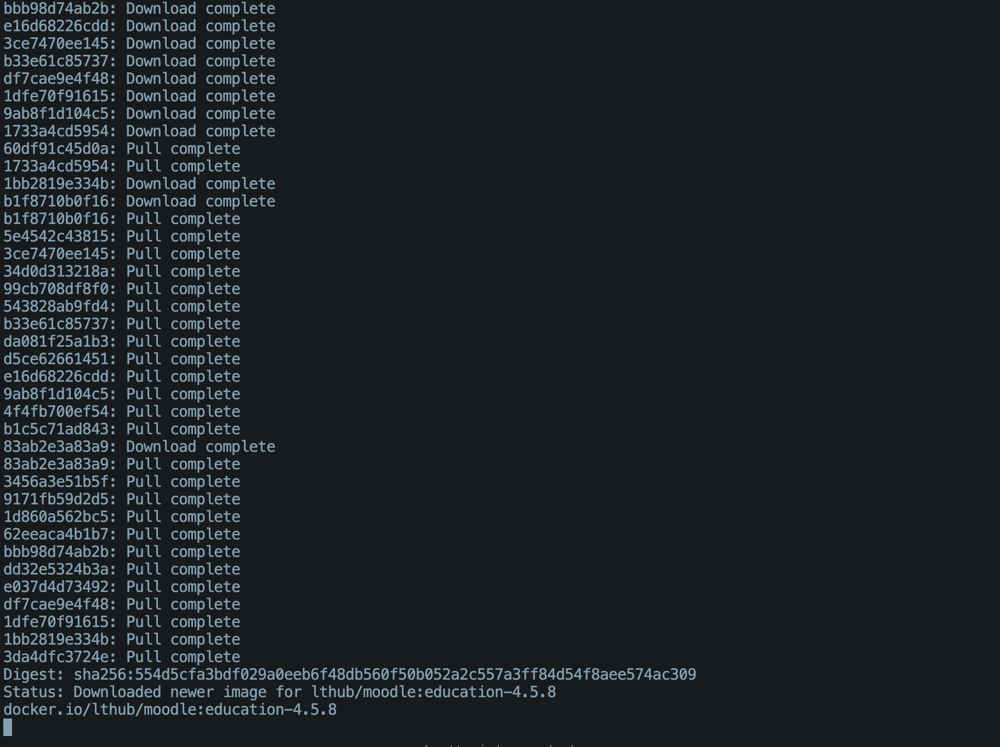
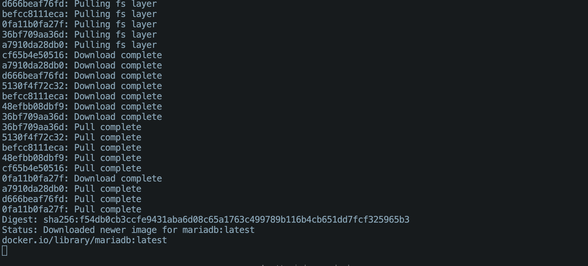

---

### บันทึกที่ 2: ผลการรัน docker-compose

```bash
docker-compose up -d
```


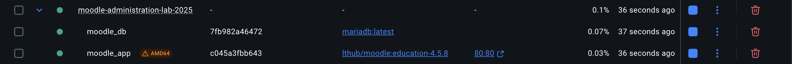

---

### บันทึกที่ 3: ผลการตรวจสอบสถานะ

```bash
docker-compose ps
```

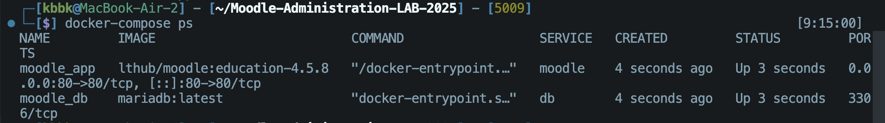

---

### บันทึกที่ 4: ผล Logs

```bash
docker-compose logs -f moodle
```

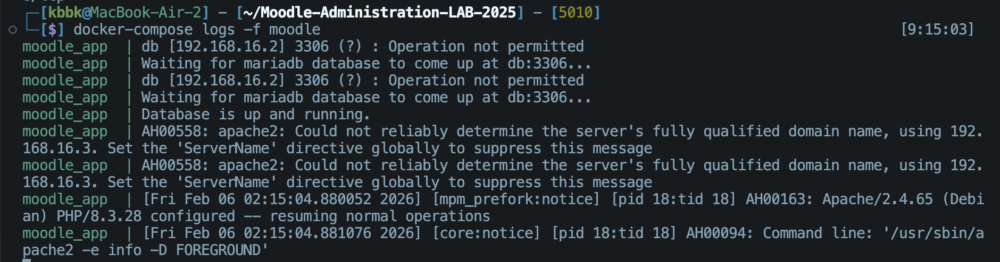

---

### บันทึกที่ 5: ผลการตรวจสอบ Volume และ Network

```bash
docker network ls
docker volume ls
docker volume inspect moodle-docker_moodledata
```

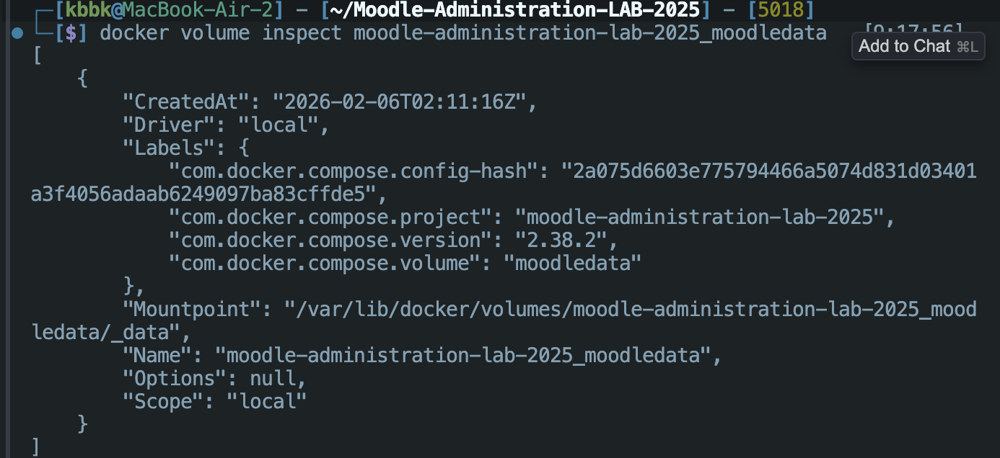

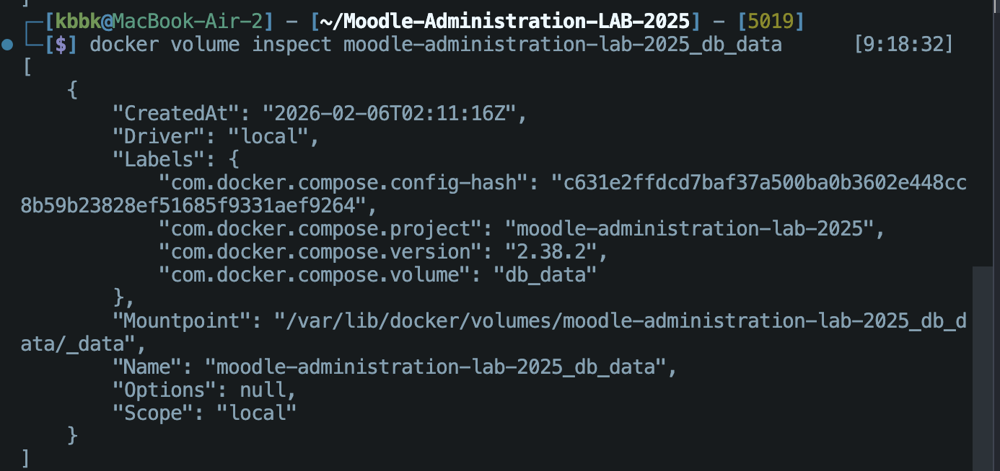

---

### บันทึกที่ 6: Dashboard หลังติดตั้งเสร็จ


---

### บันทึกที่ 6-1: ผลการปรับแต่ง Theme

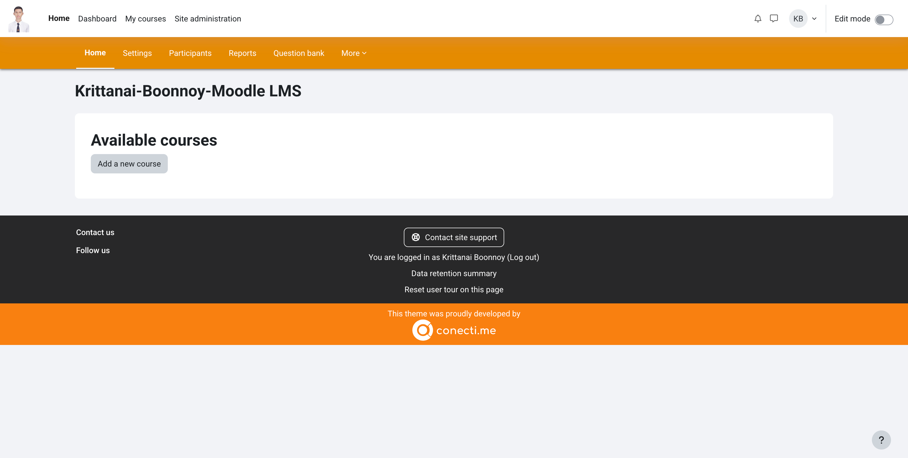
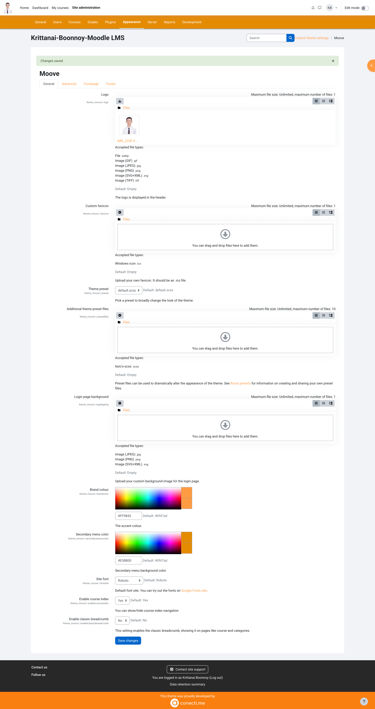

---

### บันทึกที่ 7: Course Categories ตามกลุ่มสาระ สพฐ.


---

### บันทึกที่ 8: ผลการสร้างรายวิชา

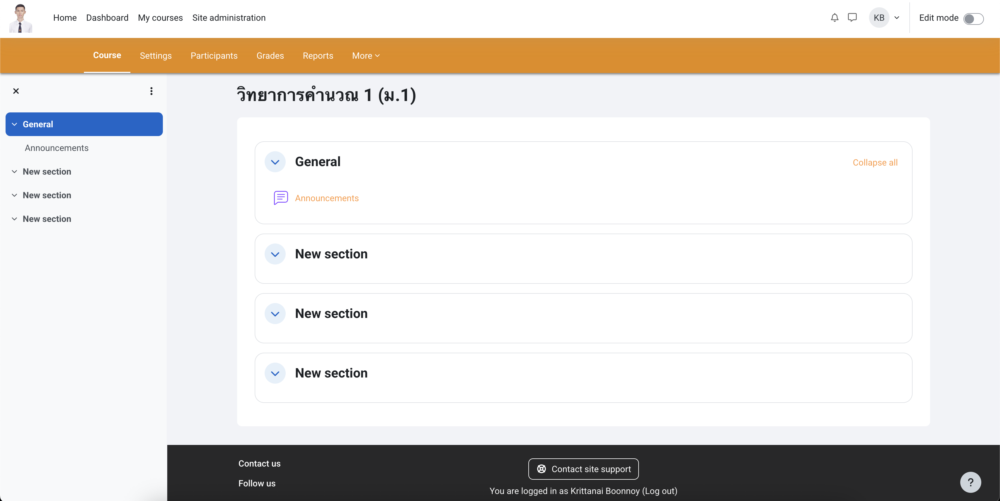

---

### บันทึกที่ 9: ผลการสร้าง User ใหม่


---

### บันทึกที่ 10: ผลการ Upload Users (CSV)

ไฟล์ CSV ที่ใช้: [users.csv](users.csv)

```csv
username,password,firstname,lastname,email,city,country
student001,Pass@123,สมชาย,ใจดี,student001@example.com,Bangkok,TH
student002,Pass@123,สมหญิง,รักเรียน,student002@example.com,Bangkok,TH
student003,Pass@123,สมศักดิ์,ขยัน,student003@example.com,Bangkok,TH
```


---

### บันทึกที่ 11: ผลการ Upload Users + Cohort

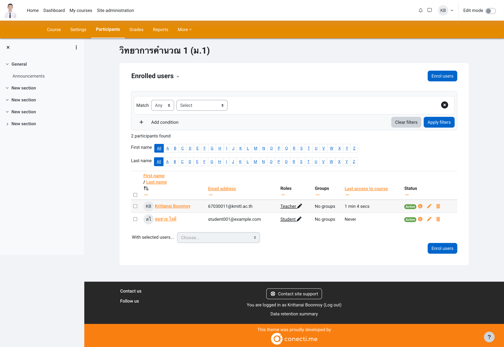
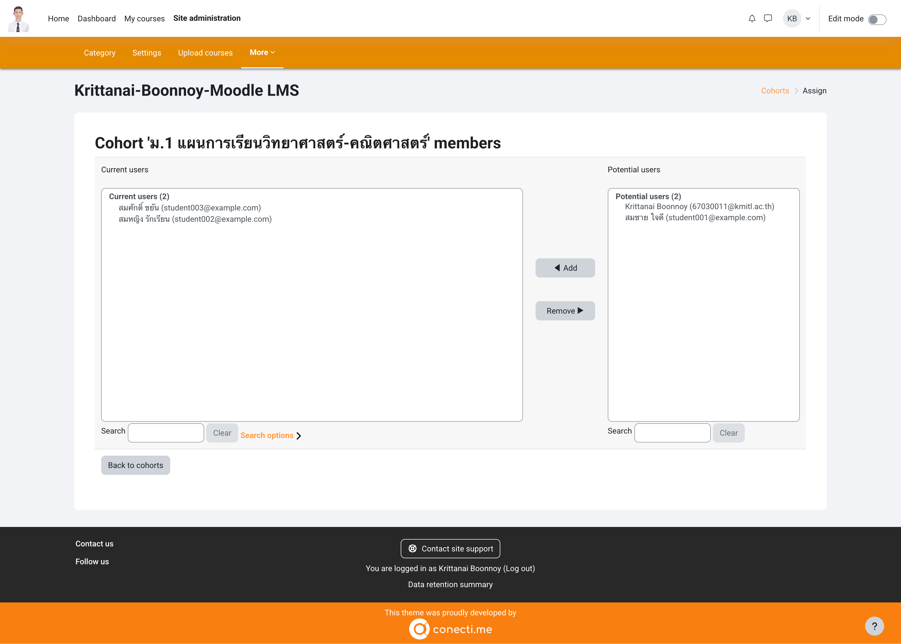


---

## ส่วนที่ 2: คำตอบท้ายใบงาน (11 ข้อ)

### ข้อ 1: อธิบายความแตกต่างระหว่าง Docker Image และ Docker Container พร้อมยกตัวอย่าง

```
Docker Image เป็นไฟล์ที่อ่านได้อย่างเดียว (Read-only) ที่บรรจุ OS และ Lib ทุกอย่างไว้
Docker Container เป็น Instance ที่ถูกสร้างมาจาก Image มีการทำงานจริงและเก็บข้อมูลชั่วคราวได้
```

---

### ข้อ 2: จากสถาปัตยกรรมในการทดลอง มี Container กี่ตัว? แต่ละตัวมีหน้าที่อะไร?

```
moodle_db (MariaDB) ทำหน้าที่เป็น Database
moodle_app (Moodle) หน้าที่เป็น Web Server
```

---

### ข้อ 3: จากการทดลองมีการจัดการ Volume แบบใด มีข้อดีข้อเสียอย่างไร?

```
เป็นการใช้ Named Volumes (db_data และ moodledata)
ข้อดีคือ ข้อมูลไม่หายเมื่อลบ Container, Docker จัดการพื้นที่เก็บข้อมูลให้เองโดยอัตโนมัติ
ข้อเสียคือ เข้าถึงไฟล์จากฝั่ง Host ได้ยาก
```

---

### ข้อ 4: Network ใน Docker Compose ทำหน้าที่อะไร? Container สื่อสารกันอย่างไร?

```
Virtual Network เชื่อม Container เข้าด้วยกัน
สื่อสารกันผ่าน Service Name (moodle คุยกับ db)
```

---

### ข้อ 5: `depends_on` ในไฟล์ docker-compose.yml มีความสำคัญอย่างไร?

```
ใช้กำหนด ลำดับการเริ่มทำงาน ต้องรัน db ให้เสร็จ ถึงจะเริ่มรัน moodle ได้
```

---

### ข้อ 6: ถ้าต้องการเปลี่ยน Port ของ Moodle เป็น 9000 ต้องแก้ไขส่วนใดของไฟล์?

```
ports:9000:80
โดยแก้ใน ใน Service moodle
```

---

### ข้อ 7: Environment Variables `MOODLE_DB_HOST=db` หมายความว่าอย่างไร? ทำไมไม่ใช้ `localhost`?

```
Moodle ไปเชื่อมต่อกับเครื่องที่ชื่อ db(ตรงกับService) และที่ไม่ใช่localhost เพราะ localhost ของ Moodle หมายถึงตัวมันเอง ซึ่งไม่มี Database รันอยู่ข้างใน
```

---

### ข้อ 8: เปรียบเทียบข้อดีและข้อเสียของการติดตั้ง Moodle ด้วย Docker เทียบกับการติดตั้งแบบปกติ

```
ข้อดีคือ ติดตั้งคำสั่งเดียวจบ, ย้ายเครื่องสะดวก , ตัดปัญหา Library
ข้อเสียคือ กินทรัพยากรเครื่องมากกว่า
```

---

### ข้อ 9: ถ้าต้องการเพิ่ม Container Redis สำหรับ Caching จะต้องแก้ไข docker-compose.yml อย่างไร?

```yaml
redis:
    image: redis:alpine
    container_name: moodle_redis
    networks:
      - moodle_network
```

---

### ข้อ 10: ถ้า Container moodle_app ไม่สามารถเชื่อมต่อ Database ได้ จะตรวจสอบและแก้ไขอย่างไร?

```
วิธีตรวจสอบ:
docker logs moodle_app (ดู Error)
docker ps (Check Status)
วิธีแก้ไข:
เช็ค MYSQL_PASSWORD ตรงกับ MOODLE_DB_PASSWORD เช็คว่าทั้งคู่ใช้ networks วงเดียวกัน
```

---

### ข้อ 11: ถ้ารัน `docker-compose down -v` จะเกิดอะไรขึ้นกับข้อมูล?

```
ข้อมูลหาย -v จะทำให้Docker ลบ Named Volumes ทั้งหมด
```

---

## ไฟล์ประกอบการทดลอง

| ไฟล์ | คำอธิบาย |
|------|----------|
| [docker-compose.yml](docker-compose.yml) | ไฟล์ Docker Compose ที่ใช้ในการทดลอง |
| [users.csv](users.csv) | ไฟล์ CSV สำหรับ Upload Users |
| [Moodle_Docker_Lab_Complete.md](Moodle_Docker_Lab_Complete.md) | ใบงานฉบับเต็ม |

---

## โครงสร้างโฟลเดอร์

```
Moodle-Administration-LAB-2025/
├── README.md                    # รายงานผลการทดลอง (ไฟล์นี้)
├── Moodle_Docker_Lab_Complete.md  # ใบงานฉบับเต็ม
├── docker-compose.yml           # Docker Compose config
├── users.csv                    # ไฟล์ CSV สำหรับ Upload Users
└── images/
    ├── diagrams/                # รูป Architecture
    │   ├── vs_container.png
    │   ├── moodle_architecture.png
    │   ├── architecture.png
    │   ├── architecture2.png
    │   ├── architecture3.png
    │   └── volumedata.jpg
    └── screenshots/             # Screenshots ผลการทดลอง
        ├── 01-docker-pull-lthub.png
        ├── 02-docker-pull-mariadb.png
        ├── ...
        └── 20-users-with-cohort.png
```
