บันทึกผลการทดลอง 1
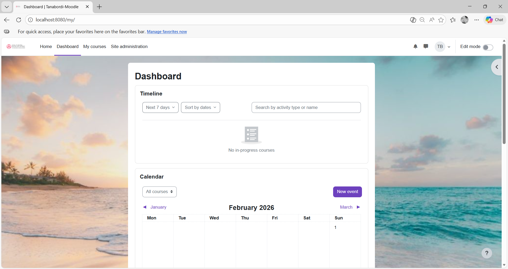

บันทึกผลการทดลอง 2
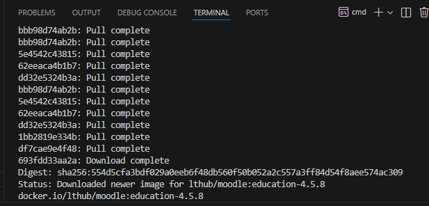

บันทึกผลการทดลอง 3
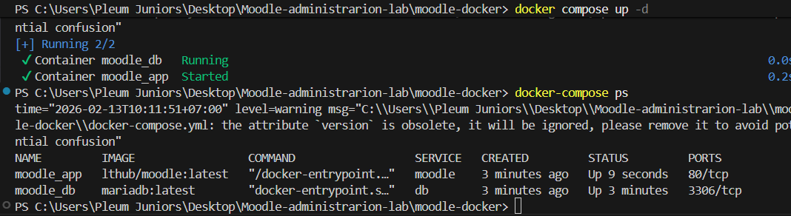

บันทึกผลการทดลอง 4
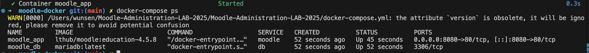

บันทึกผลการทดลอง 5
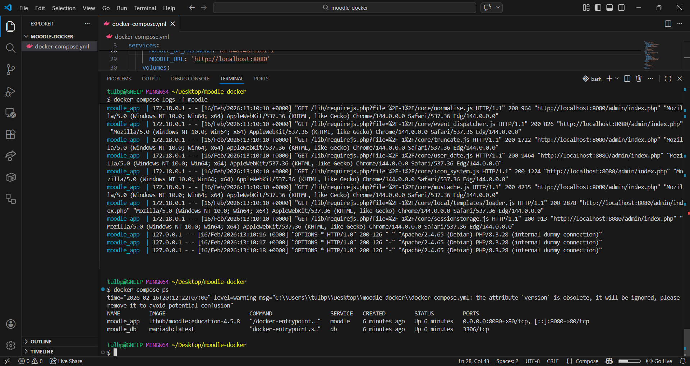

บันทึกผลการทดลอง 6
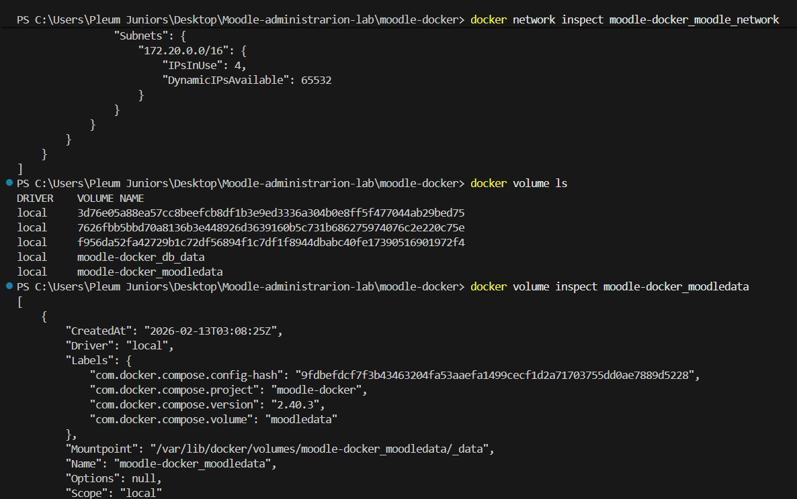

บันทึกผลการทดลอง 7
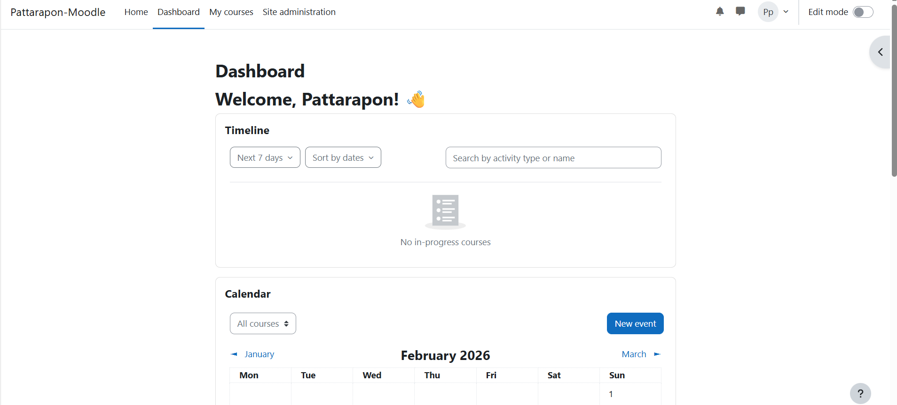

บันทึกผลการทดลอง 6.1 ผลการปรับแต่ง Team
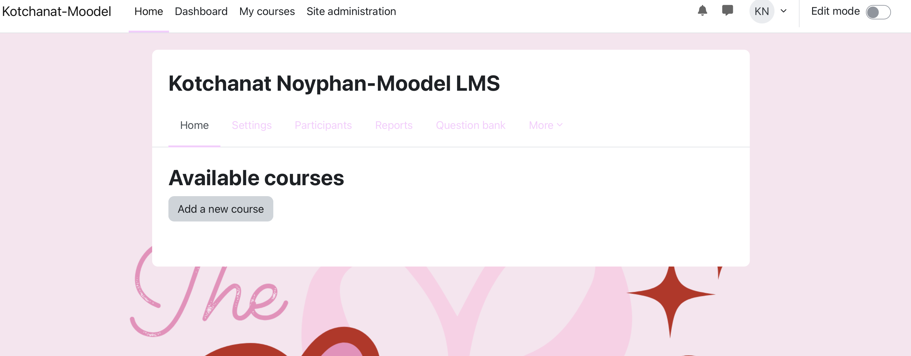

บันทึกผลการทดลอง 7 หน้า Category
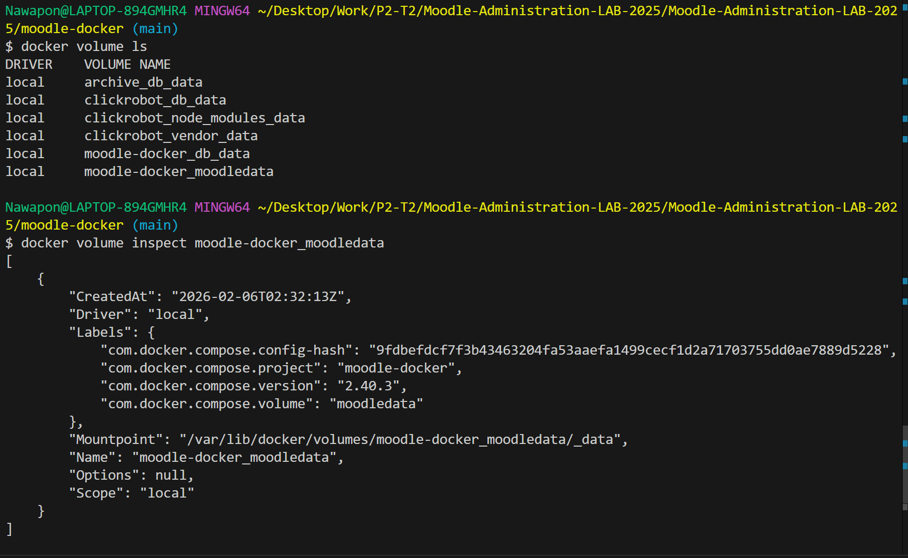

บันทึกผลการทดลอง 8
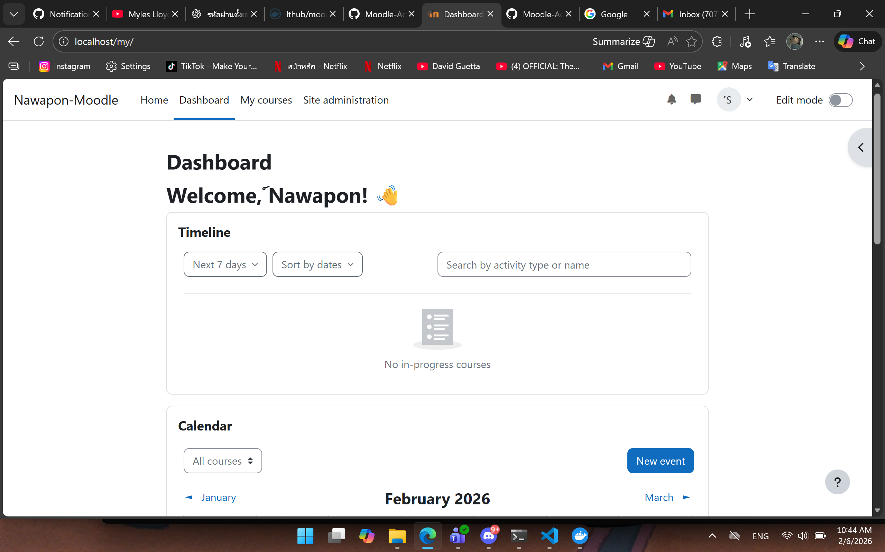

บันทึกผลการทดลอง 9
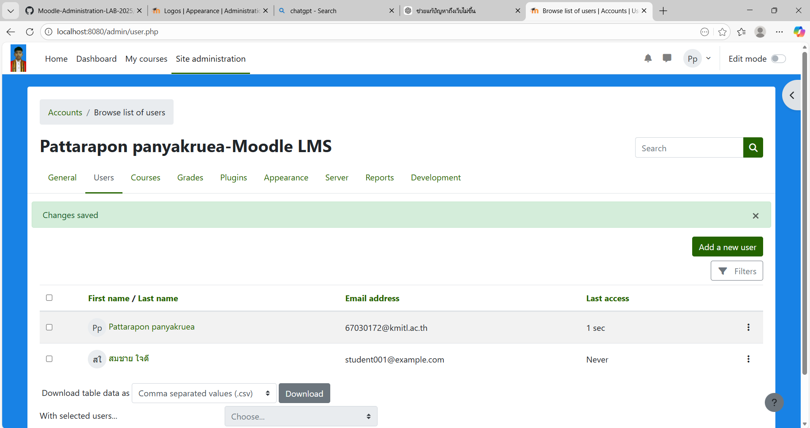

บันทึกผลการทดลอง 10
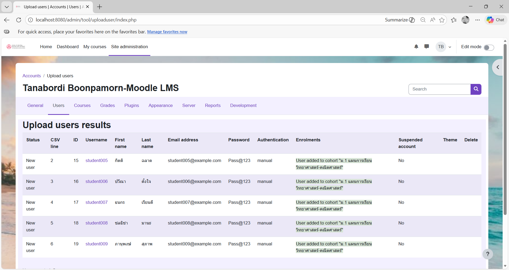

บันทึกผลการทดลอง 11

คำถามท้ายใบงาน
1. อธิบายความแตกต่างระหว่าง Docker Image และ Docker Container พร้อมยกตัวอย่าง
Docker Image คือไฟล์ต้นแบบที่รวมระบบและโปรแกรมที่จำเป็นไว้สำหรับสร้างสภาพแวดล้อมของแอปพลิเคชัน โดย Image เป็นแบบ Read-only และยังไม่ทำงานจนกว่าจะถูกนำไปใช้งาน ส่วน Docker Container คือสิ่งที่ถูกสร้างจาก Image และเป็นตัวที่กำลังทำงานจริง สามารถเริ่ม หยุด ลบ และมีการเปลี่ยนแปลงข้อมูลระหว่างใช้งานได้ ตัวอย่างเช่น nginx เป็น Docker Image และเมื่อใช้คำสั่ง docker run nginx จะได้ Container ที่ทำหน้าที่เป็นเว็บเซิร์ฟเวอร์ nginx ที่กำลังทำงานอยู่จริง

2. จากสถาปัตยกรรมในการทดลอง มี Container กี่ตัว? แต่ละตัวมีหน้าที่อะไร?
- Kali Linux Container
ทำหน้าที่เป็นเครื่องสำหรับผู้ทดสอบ (Attacker) ใช้เปิดเว็บเบราว์เซอร์และเครื่องมือทดสอบเจาะระบบ เช่น Firefox และเครื่องมือด้าน Security
- Mutillidae 2 Container
ทำหน้าที่เป็นเครื่องเป้าหมาย (Victim / Web Application Server) ให้บริการเว็บแอปพลิเคชัน Mutillidae 2 สำหรับใช้ในการฝึกทดสอบช่องโหว่เว็บ เช่น SQL Injection และ XSS

3. จากการทดลองมีการจัดการ Volume แบบใด มีข้อดีข้อเสียอย่างไร?
จากการทดลองมีการจัดการ Volume แบบ Docker Volume (Named Volume) หรือการใช้ Volume ที่ Docker สร้างและจัดเก็บให้โดยอัตโนมัติ เพื่อเก็บข้อมูลสำคัญของระบบ เช่น ข้อมูลเว็บไซต์หรือฐานข้อมูลให้คงอยู่แม้ Container จะถูกปิดหรือลบ
ข้อดี คือช่วยให้ข้อมูลไม่สูญหายเมื่อ restart หรือ remove container และสามารถนำข้อมูลกลับมาใช้งานได้ง่าย รวมถึงสะดวกในการสำรองข้อมูล
ข้อเสีย คือผู้ใช้ไม่เห็นตำแหน่งไฟล์จริงชัดเจนในเครื่อง ทำให้การจัดการไฟล์โดยตรงทำได้ยาก และหากลบ volume ผิดอาจทำให้ข้อมูลสูญหายถาวรได้

4. Network ใน Docker Compose ทำหน้าที่อะไร? Container สื่อสารกันอย่างไร?
Network ใน Docker Compose ทำหน้าที่เป็นเครือข่ายกลางสำหรับเชื่อมต่อ Container ต่าง ๆ ให้สามารถติดต่อกันได้ภายในระบบเดียวกัน โดย Compose จะสร้าง network อัตโนมัติ เพื่อให้ container อยู่ในวงเครือข่ายเดียวกัน
Container สื่อสารกัน ผ่านชื่อ service หรือชื่อ container แทนการใช้ IP เช่น Kali สามารถเข้าถึง Mutillidae ได้โดยใช้ชื่อ service (เช่น mutillidae) ผ่าน port ที่กำหนด ทำให้การเชื่อมต่อสะดวกและไม่ต้องจำ IP address ของ container

5. depends_on ในไฟล์ docker-compose.yml มีความสำคัญอย่างไร?
depends_on ในไฟล์ docker-compose.yml มีความสำคัญเพราะใช้กำหนดว่า Container ใดต้องเริ่มทำงานก่อน เพื่อให้ระบบทำงานเป็นลำดับที่ถูกต้อง โดยช่วยให้ Docker Compose สร้างและเริ่มต้น service ที่เป็น “ตัวหลัก” ก่อน แล้วจึงเริ่ม service ที่ต้องพึ่งพา
ตัวอย่างเช่น หาก Kali ต้องใช้งาน Mutillidae ก็สามารถกำหนด depends_on เพื่อให้ Mutillidae เริ่มทำงานก่อน ลดปัญหาการเชื่อมต่อไม่สำเร็จในช่วงเริ่มต้นระบบ

6. ถ้าต้องการเปลี่ยน Port ของ Moodle เป็น 9000 ต้องแก้ไขส่วนใดของไฟล์?
ถ้าต้องการเปลี่ยน Port ของ Moodle เป็น 9000 ต้องแก้ไขที่ส่วน ports: ในไฟล์ docker-compose.yml
ports:
  - "9000:80"
  หมายความว่า เปิดใช้งาน Moodle ผ่านพอร์ต 9000 ของเครื่องเรา แต่ภายใน container ยังใช้พอร์ต 80 เหมือนเดิม

7. Environment Variables MOODLE_DB_HOST=db หมายความว่าอย่างไร? ทำไมไม่ใช้ localhost?
MOODLE_DB_HOST=db หมายความว่า Moodle จะเชื่อมต่อฐานข้อมูลโดยใช้ host ชื่อว่า db ซึ่งเป็นชื่อ service (หรือชื่อ container) ของฐานข้อมูลที่กำหนดไว้ในไฟล์ docker-compose.yml
ที่ไม่ใช้ localhost เพราะใน Docker localhost หมายถึงตัว container ของ Moodle เอง ไม่ใช่ container ฐานข้อมูล ดังนั้นถ้าใช้ localhost Moodle จะหา database ไม่เจอ
การใช้ db ทำให้ Moodle สามารถติดต่อกับ container ฐานข้อมูลผ่าน Docker network ได้โดยตรง

8. เปรียบเทียบข้อดีและข้อเสียของการติดตั้ง Moodle ด้วย Docker เทียบกับการติดตั้งแบบปกติ
- การติดตั้ง Moodle ด้วย Docker มีข้อดีคือสามารถติดตั้งได้รวดเร็ว สะดวก และลดปัญหาความไม่เข้ากันของระบบ เพราะ Docker จะรวมโปรแกรมที่จำเป็น เช่น Apache/PHP และ Database ไว้ใน container ทำให้สามารถย้ายไปใช้งานเครื่องอื่นได้ง่าย และเหมาะสำหรับการทดลองหรือการเรียนรู้
- การติดตั้ง Moodle แบบปกติ (ติดตั้งลงเครื่องโดยตรง) มีข้อดีคือสามารถควบคุมระบบได้ละเอียด เข้าใจโครงสร้างไฟล์และการตั้งค่าชัดเจน เหมาะกับการใช้งานจริงในระยะยาว แต่ข้อเสียคือขั้นตอนติดตั้งยุ่งยากกว่า ต้องติดตั้งและตั้งค่าโปรแกรมหลายส่วนเอง เช่น Web Server, PHP และ Database และอาจเกิดปัญหาเวอร์ชันไม่เข้ากันได้ง่ายกว่า Docker

9. ถ้าต้องการเพิ่ม Container Redis สำหรับ Caching จะต้องแก้ไข docker-compose.yml อย่างไร?
services:
  redis:
    image: redis:latest
    container_name: redis
    restart: always
    ports:
      - "6379:6379"
    networks:
      - moodle-network

networks:
  moodle-network:
    driver: bridge

10. ถ้า Container moodle_app ไม่สามารถเชื่อมต่อ Database ได้ จะตรวจสอบและแก้ไขอย่างไร?
วิธีตรวจสอบ:
ตรวจสอบว่า container database ทำงานอยู่หรือไม่ด้วยคำสั่ง
docker ps

ตรวจสอบ log ของ database และ moodle_app
docker logs db
docker logs moodle_app

ตรวจสอบว่า MOODLE_DB_HOST, username, password ใน docker-compose.yml ถูกต้องหรือไม่
ตรวจสอบว่า container อยู่ใน network เดียวกัน
docker network ls
docker network inspect <ชื่อ_network>

ทดสอบ ping จาก moodle_app ไป db
docker exec -it moodle_app ping db

วิธีแก้ไข:
หาก db ไม่ทำงานให้ start ใหม่
docker start db

แก้ไขค่า environment variables ให้ตรงกับ database เช่น MOODLE_DB_HOST=db และรหัสผ่านให้ถูกต้อง
หาก network ผิดให้แก้ docker-compose ให้ใช้ network เดียวกัน แล้วรันใหม่ด้วย
docker-compose down
docker-compose up -d

หากฐานข้อมูลเสียหรือข้อมูลผิด ให้ลบและสร้างใหม่ (กรณีทดลอง)
docker-compose down -v
docker-compose up -d

11. ถ้ารัน docker-compose down -v จะเกิดอะไรขึ้นกับข้อมูล?
จะทำให้ หยุดและลบ Container ทั้งหมด รวมถึง ลบ Volume ที่ถูกสร้างไว้ด้วย
ดังนั้น ข้อมูลที่เก็บอยู่ใน Volume เช่น ข้อมูลฐานข้อมูล (Database) และไฟล์ข้อมูลถาวรต่าง ๆ จะถูกลบหายทั้งหมด และไม่สามารถกู้คืนได้ (ยกเว้นมีการ backup ไว้ก่อน)
